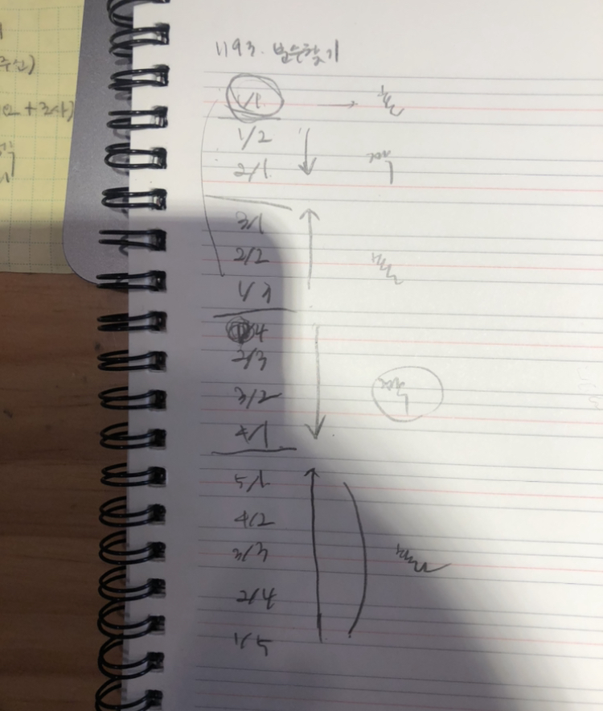

# 1193 - 분수찾기

### 문제

무한히 큰 배열에 다음과 같이 분수들이 적혀있다.

| 1/1  | 1/2  | 1/3  | 1/4  | 1/5  | …    |
| ---- | ---- | ---- | ---- | ---- | ---- |
| 2/1  | 2/2  | 2/3  | 2/4  | …    | …    |
| 3/1  | 3/2  | 3/3  | …    | …    | …    |
| 4/1  | 4/2  | …    | …    | …    | …    |
| 5/1  | …    | …    | …    | …    | …    |
| …    | …    | …    | …    | …    | …    |

이와 같이 나열된 분수들을 1/1 -> 1/2 -> 2/1 -> 3/1 -> 2/2 -> … 과 같은 지그재그 순서로 차례대로 1번, 2번, 3번, 4번, 5번, … 분수라고 하자.

X가 주어졌을 때, X번째 분수를 구하는 프로그램을 작성하시오.


### 풀이 과정

1. **접근**

   

*~~내 진짜 글씨는 이 정도는 아니다...ㅎ~~*

우선 위의 표를 보고 아래와 같이 규칙을 찾는 것은 성공했다. 

그런데 몇번 째에 분수가 있는지 알아내는 코드를 작성하기 어려웠다. 구체적으로 계속해서 +1씩 늘어나게 빼다가 0보다 작아지면 그번째에 분수가 위치해있겠구나 라는 것을 코드로 작성하는데 어려움을 느꼈다. 

그래서 다른 사람의 풀이를 보게 되었다.

2. **`count`를 두자.**

   ```python
   n = int(input())		# 처음 입력
   
   num = 0							# 계속해서 1씩 더해지는 변수이다. 위의 그림에서 분수가 위치하는 구간의 num을 의미한다.
   num_count = 0				# 1씩 증가하는 num을 count한다.
   
   # 1씩 증가하는 num을 num_count에 n을 초과하지 전까지 계속해서 더한다.
   while num_count < n:
     num += 1
     num_count += num
   ```

3. **분수를 찾자.**

   ```python
   num_count -= num
   x = n-num_count
   
   if num % 2 == 0:
     i = x
     j = num - x + 1
    else:
     i = num - x + 1
     j = x
    
   print(f"{i}/{j}")
   ```

   - `-=`

     할당연산자 중 하나로, 왼쪽 변수에 오른쪽 값을 빼고 그 결과를 왼쪽 변수에 할당함을 의미한다.

   - 사진에서 확인할 수 있듯이 num이 홀수인지 짝수인지에 따라 규칙이 달라진다. 
   - num이 짝수일 때,
     - `i` 는 해당 구간 안에서 위에서부터 증가하고
     - `j` 는 아래에서부터 증가한다. 

4. **출력한다.**

   ```python
   print(f"{i}/{i}")
   ```

   Python3.6 이상부터 제공되는 f-string을 통해 간단하게 출력한다.


### 전체 코드

```python
n = int(input())

num = 0             
num_count = 0       

while num_count < n:
    num += 1
    num_count += num

num_count -= num  
x = n-num_count     

if num % 2 == 0:
    i = x
    j = num - x + 1
else:
    i = num - x +1
    j = x

print(f"{i}/{j}")
```


간단하게 느낀 점을 쓰자면,

count의 역할을 알게되었다! 